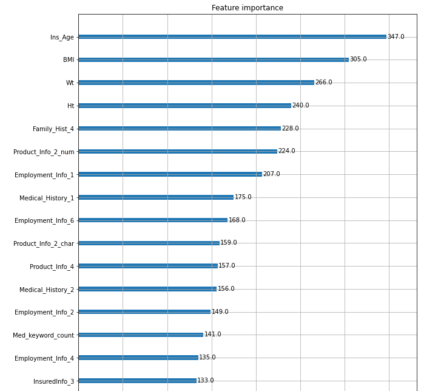

```{r setup, include=FALSE}
knitr::opts_chunk$set(echo = TRUE)
library(kableExtra)
```

```{r, echo=FALSE, warning=FALSE, results=FALSE}
Empty_CM_DF <- data.frame(c(NA,NA),c(NA,NA), row.names=c(0,1)); colnames(Empty_CM_DF) = c(0,1)

Metric_Fxn <- function(df){
  TN = df["0","0"]
  TP = df["1","1"]
  FN = df["0","1"]
  FP = df["1","0"]
  
  Metric_DF <- data.frame(c(NA),c(NA),c(NA)); colnames(Metric_DF) = c("Accuracy","Precision","Recall")
  
  Metric_DF['Accuracy'] = (TP + TN)/(TP + TN + FP + FN)
  Metric_DF['Precision'] = (TP)/(TP+FN)
  Metric_DF['Recall'] = (TP)/(TP+FP)
  Metric_DF['F1'] = 2*(Metric_DF['Precision']*Metric_DF['Recall'])/(Metric_DF['Precision']+Metric_DF['Recall'])
  
  return(kable(Metric_DF) %>% kable_styling(position = "center",latex_options = "HOLD_position"))
}
```

# Principal Component Analysis (PCA)

In examining our dataset, one of the first considerations made was on whether or not we could sufficiently reduce the dimensions to make it easier to work with. The go-to method of PCA, unfortunately, is best utilized on continuous variables. It is possible to one-hot encode the dataset prior to running PCA, but the binary results do not tend to yield good results as while PCA tries to minimize variance, this does not work well for binary data.

Still, for the sake of trying, PCA was run with specifications for quantitative/continuous columns as well as qualitative/categorical ones to one-hot encode.

The end results were quite poor as expected, with the first dimension explaining ~4%, the next ~3%, with each subsequent dimension explaining less and less. As a result of these findings, PCA was not utilized.

{width=300}


\newpage

# One-Hot Encoding

For the below sections, one-hot encoding was used. As a quick explanation, one-hot encoding is a method in which nominal data (i.e. un-order-able categories) is, in a way, standardized to allow different models/algorithms to quantify and map relationships.

Consider for examples sake a column "color" that contains the possible categories \{red, blue, green\}. For many models, strings are not interpretable. We could convert these to integers \{1, 2, 3\} respectively - but that might imply some ordered (ordinal) relationship where 2>1. But blue > red is not a quantifiable statement. So simply converting our values to integers is not appropriate. This would be called integer encoding.

We instead move on to one-hot encoding. Instead of converting the categories to integers within the column, we make a column for each category. And so the "color" column might become "color_red","color_blue","color_green". With these columns, we can quickly indicate which color/category an entry falls under using binary \{0,1\} notation, where a 1 represents true and 0 represents false. In this case only one of the three columns for each row could have a 1 value while the rest would be 0.

As we've now mapped these categories to binary values, we've avoided suggesting an ordered relationship and instead have made the categories into indicator variables.

#### One-Hot Encoding Shortcoming (TO BE REMOVED AFTER IF CAN GET FULL BINARY SET RUNNING):

Due to discovering one-hot encoding as a requirement for certain methods *after* the data cleaning process, some instances occurred where the test set had categories that the training set did not have. As a result, the training set used for other models was further broken into its own train/test set post one-hot encoding to ensure columns matched.

\newpage

# Support Vector Machine (SVM)

In Support Vector Machine (SVM) Learning, the model attempts to maximize hinge loss - in other words, maximize the distance of a hyper-plane between the two classifications. Another way to think of this is that the SVM algorithm examines only the points that are hardest to classify (the "hinge" cases) into one category or another and then draws a hyper-plane in a way that the cases on one side vs. another are maximizing the margin around the hyper-plane.

The goal of SVM is overall similar to LDA, however, where LDA tries to maximize separability between classes in general for all data points, SVM tries to maximize separability of just the "hard-to-classify" points.

For SVM's, there are two key points to keep in mind when applying to data:

(1) Data must be normalized so that small differences between dimensions are not exaggerated (e.g. one dimension 100-1000 while another is 0-1).

(2) Ordinal and Nominal Data must be distinguished and handled. As discussed above, in the case of ordinal data we simply convert to integers and standardize. In the case of nominal data, we one-hot encode.

With the explanation done, we now examine the same training data as the above methods, but with nominal categorical columns one-hot encoded. **It should be noted that the parameter tuning was done against a 5-fold cross-validation set while the evaluation metrics are from a testing set (as tuning was very involved, the respective validation metrics are not shown here).**

## Linear Kernel

```{r, echo=FALSE, warning=FALSE, results=FALSE}
SVM_Linear_CM <- Empty_CM_DF
SVM_Linear_CM["0","0"] = 851
SVM_Linear_CM["0","1"] = 228
SVM_Linear_CM["1","0"] = 218
SVM_Linear_CM["1","1"] = 703

SVM_Linear_EM <- Metric_Fxn(SVM_Linear_CM)
SVM_Linear_CM <- kable(SVM_Linear_CM)  %>% kable_styling(position = "center", latex_options = "HOLD_position")

```

We first examine the SVM algorithm utilizing a simple linear kernel as this can often provide decent results while significantly reducing computing costs. Our evaluation metrics are:

`r SVM_Linear_EM`

Considering our results gathered with other methods, a 77% accuracy for a simple linear model is quite good. But maybe we can improve the accuracy by adjusting our SVM Kernel.

## Polynomial Kernel

```{r, echo=FALSE, warning=FALSE, results=FALSE}
SVM_Poly_CM <- Empty_CM_DF
SVM_Poly_CM["0","0"] = 839
SVM_Poly_CM["0","1"] = 240
SVM_Poly_CM["1","0"] = 229
SVM_Poly_CM["1","1"] = 692

SVM_Poly_EM <- Metric_Fxn(SVM_Poly_CM)
SVM_Poly_CM <- kable(SVM_Poly_CM)  %>% kable_styling(position = "center", latex_options = "HOLD_position")

```

We now examine the SVM algorithm utilizing a polynomial kernel with degree 3, and similarly find:

`r SVM_Poly_EM`

which has provided no real substantial change other than to slightly decrease our metrics. A degree of 2 and other higher degrees were also examined yet yielded no substantial change.

## RBF Kernel

When utilizing the Radial Basis Function (RBF), it is important to correctly set our C and Gamma values. Our C value indicates the trade off of trying to classify every example correctly or not. A high C tries to classify everything correctly, while a low C allows for some misclassificaitons.

On the other hand, Gamma determines the influence of a single training example wherein a larger gamma, the closer other training examples need to be to be impacted. With the simple default parameters (as in the prior models), we find:

```{r, echo=FALSE, warning=FALSE, results=FALSE}
SVM_RBF1_CM <- Empty_CM_DF
SVM_RBF1_CM["0","0"] = 829
SVM_RBF1_CM["0","1"] = 250
SVM_RBF1_CM["1","0"] = 243
SVM_RBF1_CM["1","1"] = 678

SVM_RBF1_EM <- Metric_Fxn(SVM_RBF1_CM)
SVM_RBF1_CM <- kable(SVM_RBF1_CM)  %>% kable_styling(position = "center", latex_options = "HOLD_position")

```

`r SVM_RBF1_EM`

which again is quite similar yet requires more costly computation.

## Proper Choice of C and Gamma:

Due to computational cost, the optimal C and Gamma were not rigorously examined. However, the approach to optimize C and Gamma is still worth mentioning. Simply put, one would create a list for C and Gamma where each value in the respective lists is an exponential increase from the prior entry. The unique matches for these parameters would then be examined to find the optimal values which would serve as a starting point for further tuning.

The default C value is 1, while the default gamma value depends on the fitted data. For RBF, this was 0.015.

Though not shown above, and though not a rigorous computational examination, differing C values were tested at user discretion. Our linear model was also tested with C = \{3,7\}. Findings showed that whether C was 3 or 7, the evaluation metrics were at most 0.5% greater than when C=1.
       
However, in the case of RBF, changing our default C to 3 took our ~75% accuracy up to ~78%. A further change in C to 7 ended up over-fitting our model (though still higher than C=1). Seeing significant gain with C=3 but some loss with C=7, C=\{4,5\} were also tested. In the end it was found that C=3 was optimal for RBF, giving the evaluation metrics:

```{r, echo=FALSE, warning=FALSE, results=FALSE}
SVM_RBF3_CM <- Empty_CM_DF
SVM_RBF3_CM["0","0"] = 863
SVM_RBF3_CM["0","1"] = 216
SVM_RBF3_CM["1","0"] = 218
SVM_RBF3_CM["1","1"] = 703

SVM_RBF3_EM <- Metric_Fxn(SVM_RBF3_CM)
SVM_RBF3_CM <- kable(SVM_RBF3_CM)  %>% kable_styling(position = "center", latex_options = "HOLD_position")

```

`r SVM_RBF3_EM`

Now in adjusting gamma, we tried various values around the default 0.015 such as 0.01 and 0.02 among others. However, adjustments in both directions yielded no significant increase in metrics.

## SVM Analysis Shortcomings:

### Shortcoming 1:

As our data is fully anonymized, the classification of certain columns into ordinal vs. nominal is not easily determined. This is one fundamental decision that has been made with no strong basis/grounds to support it. As the data is completely anonymized with only a generic header name to go off of, assumptions must be made that could very well be incorrect. This paragraph is simply to acknowledge that the distinction between ordinal/nominal is a thin line and that our process may have classified these groupings incorrectly.

### Shortcoming 2:

SVM is an incredibly intensive algorithm with computational cost $O(n_{\text{features}} * n_{\text{observations}}^2)$. As a result of this, the algorithm was only run on smaller subsets of the testing/training datasets so as to avoid incredibly large run-times. As even this subset is still quite large (~40,000 rows by 900 columns post one-hot encode), we believe the results should still be sufficient. Breakdown can be found in code within the appendix.

\newpage
\newpage
\newpage
\newpage
\newpage

# XGBoost (XGB)

Though not directly covered in this course, at a very high level XGBoost is a decision-tree based algorithm similar to Random Forest but instead of utilizing bagging, it utilizes boosting (stochastic gradient descent boosting to be exact wherein we minimize a loss function). 

## Model Creation

Our XGB model had many parameters that could be set - for our initial model, we chose very conservatively to prevent overfitting and start as a baseline. We then performed 5-fold cross-validation while examining other parameters, mainly changing those that would make our model less conservative (alpha, eta, depth). Many variations were attempted, but none provided very significant changes. The largest impact came from changing tree depth, but even depths of 2 with very conservative parameter choices only shifted metrics by about 3%. All variations had accuracy rates between 76% and 80%, no matter the changes in tree depth, learning rate, and other parameters. More info on XGB can be found [here](https://xgboost.readthedocs.io/en/stable/parameter.html).

Utilizing our best cross-validated model, we ran predictions against the test set. Our metrics were:


```{r, echo=FALSE, warning=FALSE, results=FALSE}
XGB_CM <- Empty_CM_DF
XGB_CM["0","0"] = 5242
XGB_CM["0","1"] = 1131
XGB_CM["1","0"] = 1241
XGB_CM["1","1"] = 4262

XGB_EM <- Metric_Fxn(XGB_CM)
XGB_CM <- kable(XGB_CM)  %>% kable_styling(position = "center", latex_options = "HOLD_position")

```

`r XGB_EM`

Which is inline with what we've seen for other methods. As a quick examination, we can look at some of the top F-Scores for predictors and see which the model considers to be the most important. After Insured_Info_3, F-Scores drop drastically. A tree diagram could not be included even in appendices due to depth and size.

{width=400}

\newpage

# Neural Networks

## Binary Classification

Lastly, we examine a classification attempt utilizing a Neural Network. We utilize the one-hot encoded data version we mentioned earlier, which results in 910 predictors. The key choices in our network that impact accuracy are:

(1) \# of Hidden Layers

(2) Structure of Hidden Layers

(3) Loss Optimizer Function

(4) Activation Function

(5) Epochs/Batch Size

Generally speaking, there is no right choice for the structure of our Neural Network. A large amount comes down to trial and error, especially when regarding binary data. As for loss optimizer, we select binary cross-entropy. We also choose activation function Sigmoid for the same reason. Our Epochs are the number of training cycles and batch size is the number of samples in the training cycle.

We start with a simple network utilizing 1 hidden layer and 8 nodes. We model the accuracy and loss per epoch as follows:

{width=300} {width=300}

We can clearly see that our accuracy plateaus after epoch 8 at around 77%. This is in line with what we'd expect from other models results. However - keeping only 1 hidden layer and changing the number of nodes, be it 1 or 800 the accuracy stays about the same. What about if we add more hidden layers? We utilize a simple structure of 5 hidden layers with nodes \{8, 16, 32, 16, 8\} respectively.

Even with more hidden layers and nodes within them, we end up with very similar results by epoch 10. Many more variations were tested and none were able to differ much from 77% by epoch 8.

With this in mind, we will fit a model with 3 hidden layers and nodes \{8, 16, 8\} and predict with our test data. Our end metrics are:

```{r, echo=FALSE, warning=FALSE, results=FALSE}
NN_CM <- Empty_CM_DF
NN_CM["0","0"] = 6301
NN_CM["0","1"] = 1320
NN_CM["1","0"] = 1964
NN_CM["1","1"] = 4667

NN_EM <- Metric_Fxn(NN_CM)
NN_CM <- kable(NN_CM)  %>% kable_styling(position = "center", latex_options = "HOLD_position")

```

`r NN_EM`

Which is again in line with all of our other models.

\newpage

## Multi Classification

Though our Neural Network performed as expected, we wanted to examine if it had any more success in predicting the 8 response classes pre-dichotomization. As such, we ran similar tests on the same data simply with the response classes in their original states.

Using the same inputs and layer configuration, but now utilizing a categorical cross-entropy loss optimizer, we ran the neural network on the 1-8 classes. The accuracy for this was quite poor at 40%, but when converted back into binary data post-prediction, the accuracy was still low at just 71%.

This is to be expected though as we've now introduced multiple classification possibilities and so the network needs a bit more structure to provide power. We instead try a model with 12 hidden layers and 50 nodes per layer, as well as 32 epochs instead of 10. With this, we found that our accuracy was able to reach nearly 48%, but when converted back to binary, had an accuracy of 76%, which is the same as the binary model produced. Our end metrics were:

```{r, echo=FALSE, warning=FALSE, results=FALSE}
NNM_CM <- Empty_CM_DF
NNM_CM["0","0"] = 7675
NNM_CM["0","1"] = 2856
NNM_CM["1","0"] = 1817
NNM_CM["1","1"] = 7248

NNM_EM <- Metric_Fxn(NNM_CM)
NNM_CM <- kable(NNM_CM)  %>% kable_styling(position = "center", latex_options = "HOLD_position")

```

`r NNM_EM`

IF TIME RUN A REALLY BIG ONE?


{width=300} {width=300}


